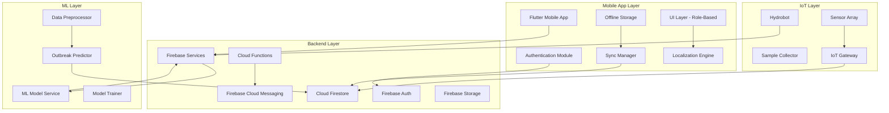
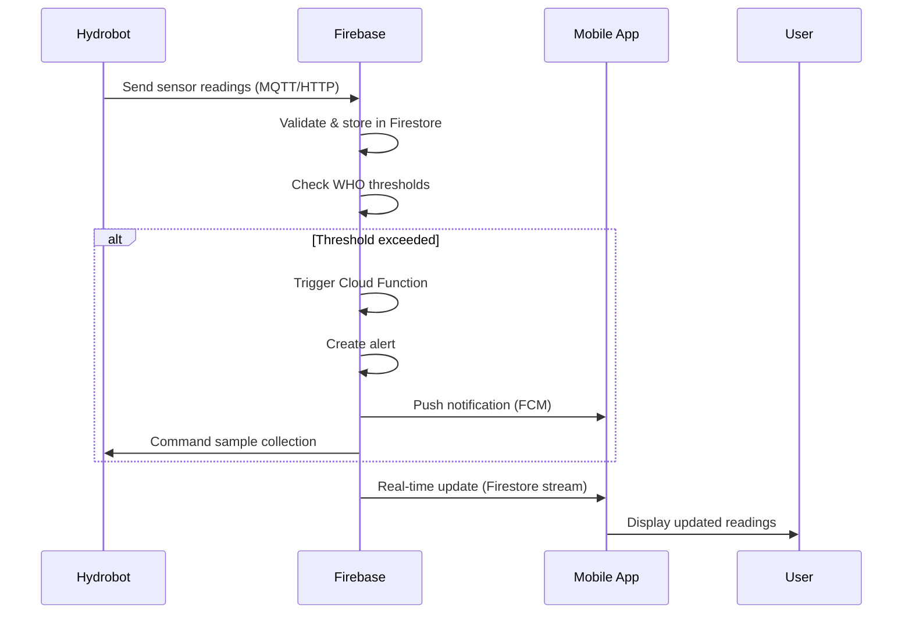
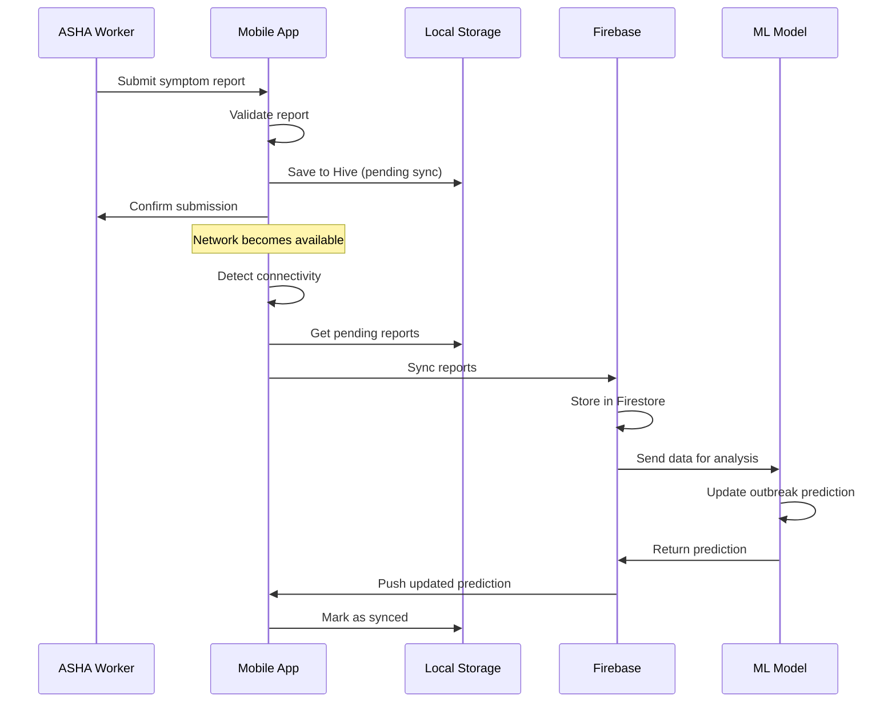

# Design Document: Niraivizhi Mobile Application

## Overview

The Niraivizhi mobile application is a Flutter-based cross-platform system that integrates with Hydrobot IoT sensors, Firebase backend services, and an ML prediction model to provide real-time water quality monitoring and waterborne disease outbreak prediction for rural North-East India. The system serves four distinct user roles with role-based access control, supports 25+ tribal languages, and operates in offline-first mode to handle intermittent connectivity.

### Key Design Principles

1. **Offline-First Architecture**: All critical features work without network connectivity, with automatic synchronization when online
2. **Role-Based Access Control**: Four distinct user experiences (ASHA Worker, Community Member, Village Leader, Health Official)
3. **Real-Time Data Streaming**: Sensor readings and alerts propagate to users within seconds
4. **Localization-First**: Multi-language support as a core architectural concern, not an afterthought
5. **Security by Design**: End-to-end encryption, data anonymization, and audit logging
6. **Graceful Degradation**: System continues operating with reduced functionality when components fail

## Architecture

### High-Level Architecture



### Technology Stack

**Mobile Application:**
- **Framework**: Flutter 3.x (Dart)
- **State Management**: Riverpod (for reactive state management and dependency injection)
- **Local Database**: Hive (lightweight, fast NoSQL database for offline storage)
- **Networking**: Dio (HTTP client with interceptors for retry logic)
- **Real-time Sync**: Firebase Realtime Database + Cloud Firestore
- **Localization**: flutter_localizations + custom translation engine
- **Charts**: fl_chart (for data visualization)
- **Maps**: Google Maps Flutter plugin

**Backend Services:**
- **Authentication**: Firebase Authentication (email/password, phone auth)
- **Database**: Cloud Firestore (real-time NoSQL database)
- **Functions**: Firebase Cloud Functions (Node.js/TypeScript)
- **Storage**: Firebase Cloud Storage (for reports, images)
- **Messaging**: Firebase Cloud Messaging (push notifications)
- **Analytics**: Firebase Analytics

**ML Infrastructure:**
- **Framework**: Python with scikit-learn, TensorFlow
- **Deployment**: Cloud Functions or Cloud Run
- **Model Storage**: Firebase ML or Cloud Storage

## Components and Interfaces

### 1. Authentication Module

**Responsibility**: Handle user authentication, role assignment, and session management.

**Key Classes:**

```dart
class AuthService {
  Future<UserCredential> signIn(String email, String password);
  Future<void> signOut();
  Future<User?> getCurrentUser();
  Stream<User?> authStateChanges();
}

class User {
  String uid;
  String email;
  UserRole role;
  String name;
  String? phoneNumber;
  String assignedArea;
  String languageCode;
}

enum UserRole {
  ashaWorker,
  communityMember,
  villageLeader,
  healthOfficial
}

class RoleBasedAccessControl {
  bool canAccessFeature(UserRole role, Feature feature);
  List<Feature> getAuthorizedFeatures(UserRole role);
}
```

**Interface:**
- `signIn(email, password) -> UserCredential`: Authenticate user with Firebase
- `signOut() -> void`: Clear session and local data
- `getCurrentUser() -> User?`: Get currently authenticated user
- `authStateChanges() -> Stream<User?>`: Listen to authentication state changes
- `canAccessFeature(role, feature) -> bool`: Check if role has access to feature

### 2. Sensor Data Module

**Responsibility**: Receive, process, and display real-time sensor readings from Hydrobot.

**Key Classes:**

```dart
class SensorReading {
  String id;
  DateTime timestamp;
  String locationId;
  double pH;
  double tds;  // Total Dissolved Solids (mg/L)
  double temperature;  // Celsius
  double turbidity;  // NTU
  double co2;  // ppm
  String hydrobotId;
}

class SensorDataService {
  Stream<SensorReading> getSensorReadingsStream(String locationId);
  Future<SensorReading?> getLatestReading(String locationId);
  Future<List<SensorReading>> getHistoricalReadings(
    String locationId, 
    DateTime startDate, 
    DateTime endDate
  );
  bool exceedsWHOThreshold(SensorReading reading);
}

class WHOThresholds {
  static const double pH_MIN = 6.5;
  static const double pH_MAX = 8.5;
  static const double TDS_MAX = 500.0;  // mg/L
  static const double TEMPERATURE_MAX = 25.0;  // °C
  static const double TURBIDITY_MAX = 5.0;  // NTU
  static const double CO2_MAX = 1000.0;  // ppm
}
```

**Interface:**
- `getSensorReadingsStream(locationId) -> Stream<SensorReading>`: Real-time stream of sensor data
- `getLatestReading(locationId) -> SensorReading?`: Most recent reading for a location
- `getHistoricalReadings(locationId, startDate, endDate) -> List<SensorReading>`: Historical data for analysis
- `exceedsWHOThreshold(reading) -> bool`: Check if any parameter exceeds WHO limits

### 3. Alert and Notification Module

**Responsibility**: Generate, manage, and deliver alerts based on sensor thresholds and outbreak predictions.

**Key Classes:**

```dart
class Alert {
  String id;
  AlertType type;
  AlertSeverity severity;
  DateTime timestamp;
  String locationId;
  String title;
  String message;
  Map<String, dynamic> metadata;
  bool isRead;
}

enum AlertType {
  waterQualityThreshold,
  outbreakPrediction,
  sampleCollectionReady,
  systemAnnouncement
}

enum AlertSeverity {
  info,
  warning,
  critical
}

class AlertService {
  Future<void> createAlert(Alert alert);
  Stream<List<Alert>> getAlertsStream(String userId);
  Future<void> markAlertAsRead(String alertId);
  Future<void> sendPushNotification(Alert alert, List<String> userIds);
  Future<List<Alert>> getAlertHistory(String userId, DateTime since);
}

class NotificationPreferences {
  bool waterQualityAlerts;
  bool outbreakAlerts;
  bool systemAnnouncements;
  TimeRange? quietHours;
}
```

**Interface:**
- `createAlert(alert) -> void`: Create and distribute new alert
- `getAlertsStream(userId) -> Stream<List<Alert>>`: Real-time stream of user's alerts
- `markAlertAsRead(alertId) -> void`: Mark alert as read
- `sendPushNotification(alert, userIds) -> void`: Send FCM push notification
- `getAlertHistory(userId, since) -> List<Alert>`: Retrieve historical alerts

### 4. Symptom Reporting Module

**Responsibility**: Collect, validate, and submit health symptom reports from ASHA Workers.

**Key Classes:**

```dart
class SymptomReport {
  String id;
  DateTime timestamp;
  String ashaWorkerId;
  String locationId;
  PatientInfo patient;
  List<Symptom> symptoms;
  int symptomDurationDays;
  bool consentObtained;
  SyncStatus syncStatus;
}

class PatientInfo {
  String anonymousId;  // No real names stored
  int age;
  Gender gender;
  String village;
}

enum Symptom {
  diarrhea,
  vomiting,
  fever,
  abdominalPain,
  dehydration,
  nausea,
  headache,
  fatigue
}

enum SyncStatus {
  pendingSync,
  synced,
  syncFailed
}

class SymptomReportService {
  Future<String> submitReport(SymptomReport report);
  Future<List<SymptomReport>> getPendingReports();
  Future<void> syncPendingReports();
  Future<List<SymptomReport>> getReportsByLocation(
    String locationId, 
    DateTime startDate, 
    DateTime endDate
  );
  bool validateReport(SymptomReport report);
}
```

**Interface:**
- `submitReport(report) -> String`: Submit symptom report (works offline)
- `getPendingReports() -> List<SymptomReport>`: Get reports waiting for sync
- `syncPendingReports() -> void`: Sync all pending reports to backend
- `getReportsByLocation(locationId, startDate, endDate) -> List<SymptomReport>`: Query reports
- `validateReport(report) -> bool`: Validate required fields

### 5. Water Sample Management Module

**Responsibility**: Track water sample collection, submission, and laboratory results.

**Key Classes:**

```dart
class WaterSample {
  String id;
  DateTime collectionTimestamp;
  String locationId;
  String hydrobotId;
  SampleStatus status;
  String? ashaWorkerId;
  DateTime? retrievalTimestamp;
  DateTime? labSubmissionTimestamp;
  LabResult? labResult;
}

enum SampleStatus {
  collectedByRobot,
  retrievedByAsha,
  submittedToLab,
  resultsReceived
}

class LabResult {
  String sampleId;
  DateTime testDate;
  int bacterialCount;  // CFU/100ml
  Map<String, double> chemicalContaminants;
  Map<String, double> heavyMetals;
  bool contaminated;
  String labName;
  String technicianId;
}

class WaterSampleService {
  Future<WaterSample> createSample(String locationId, String hydrobotId);
  Future<void> updateSampleStatus(String sampleId, SampleStatus status);
  Future<void> submitLabResult(String sampleId, LabResult result);
  Future<List<WaterSample>> getPendingSamples(String ashaWorkerId);
  Stream<WaterSample> getSampleStream(String sampleId);
}
```

**Interface:**
- `createSample(locationId, hydrobotId) -> WaterSample`: Create sample record when Hydrobot collects
- `updateSampleStatus(sampleId, status) -> void`: Update sample workflow status
- `submitLabResult(sampleId, result) -> void`: Submit laboratory test results
- `getPendingSamples(ashaWorkerId) -> List<WaterSample>`: Get samples awaiting ASHA action
- `getSampleStream(sampleId) -> Stream<WaterSample>`: Real-time updates for sample

### 6. ML Outbreak Prediction Module

**Responsibility**: Interface with ML model for outbreak prediction and display results.

**Key Classes:**

```dart
class OutbreakPrediction {
  String id;
  DateTime timestamp;
  String locationId;
  RiskLevel riskLevel;
  double confidenceScore;  // 0.0 to 1.0
  List<String> contributingFactors;
  String affectedArea;
  int estimatedCases;
  DateTime predictionValidUntil;
}

enum RiskLevel {
  low,
  moderate,
  high,
  critical
}

class MLPredictionService {
  Future<OutbreakPrediction?> getLatestPrediction(String locationId);
  Stream<OutbreakPrediction> getPredictionStream(String locationId);
  Future<List<OutbreakPrediction>> getHistoricalPredictions(
    String locationId,
    DateTime startDate,
    DateTime endDate
  );
  Future<Map<String, dynamic>> getModelAccuracyMetrics();
}

class MLInputData {
  List<SensorReading> sensorReadings;
  List<SymptomReport> symptomReports;
  List<LabResult> labResults;
  String locationId;
  DateTime timeWindow;
}
```

**Interface:**
- `getLatestPrediction(locationId) -> OutbreakPrediction?`: Most recent prediction
- `getPredictionStream(locationId) -> Stream<OutbreakPrediction>`: Real-time prediction updates
- `getHistoricalPredictions(locationId, startDate, endDate) -> List<OutbreakPrediction>`: Historical predictions
- `getModelAccuracyMetrics() -> Map`: Model performance statistics

### 7. Dashboard and Analytics Module

**Responsibility**: Provide data visualization and analytics for Health Officials and Village Leaders.

**Key Classes:**

```dart
class DashboardData {
  List<SensorReading> recentReadings;
  List<Alert> activeAlerts;
  List<SymptomReport> recentSymptoms;
  List<OutbreakPrediction> activePredictions;
  Map<String, int> symptomCounts;
  Map<String, WaterQualityStatus> locationStatuses;
}

enum WaterQualityStatus {
  safe,
  caution,
  unsafe
}

class DashboardService {
  Future<DashboardData> getDashboardData(String userId);
  Future<List<TimeSeriesDataPoint>> getTimeSeriesData(
    String locationId,
    SensorParameter parameter,
    DateTime startDate,
    DateTime endDate
  );
  Future<Map<String, dynamic>> getCorrelationAnalysis(
    String locationId,
    DateTime startDate,
    DateTime endDate
  );
  Future<List<GeographicDataPoint>> getGeographicHeatMap(
    List<String> locationIds
  );
}

class ReportGenerator {
  Future<String> generatePDFReport(ReportParameters params);
  Future<String> exportCSV(ReportParameters params);
}
```

**Interface:**
- `getDashboardData(userId) -> DashboardData`: Get aggregated dashboard data for user's role
- `getTimeSeriesData(locationId, parameter, startDate, endDate) -> List<TimeSeriesDataPoint>`: Time-series data for charts
- `getCorrelationAnalysis(locationId, startDate, endDate) -> Map`: Correlation between sensors and symptoms
- `getGeographicHeatMap(locationIds) -> List<GeographicDataPoint>`: Geographic visualization data
- `generatePDFReport(params) -> String`: Generate PDF report, return file path
- `exportCSV(params) -> String`: Export data as CSV, return file path

### 8. Localization Module

**Responsibility**: Provide multi-language support for 25+ tribal languages plus English and Hindi.

**Key Classes:**

```dart
class LocalizationService {
  Future<void> loadTranslations(String languageCode);
  String translate(String key, {Map<String, String>? params});
  List<Language> getSupportedLanguages();
  Future<void> setLanguage(String languageCode);
  String getCurrentLanguage();
}

class Language {
  String code;  // ISO 639-1 or custom code
  String nativeName;
  String englishName;
  bool isRTL;  // Right-to-left
}

class TranslationKey {
  static const String APP_TITLE = "app.title";
  static const String WATER_QUALITY_SAFE = "water.quality.safe";
  static const String ALERT_THRESHOLD_EXCEEDED = "alert.threshold.exceeded";
  // ... hundreds more keys
}
```

**Interface:**
- `loadTranslations(languageCode) -> void`: Load translation file for language
- `translate(key, params) -> String`: Get translated string for key with optional parameters
- `getSupportedLanguages() -> List<Language>`: Get all supported languages
- `setLanguage(languageCode) -> void`: Change app language
- `getCurrentLanguage() -> String`: Get current language code

### 9. Offline Sync Module

**Responsibility**: Manage offline data storage and synchronization with backend.

**Key Classes:**

```dart
class OfflineStorage {
  Future<void> saveLocally<T>(String key, T data);
  Future<T?> getLocally<T>(String key);
  Future<void> deleteLocally(String key);
  Future<List<String>> getPendingSyncKeys();
}

class SyncManager {
  Future<void> syncAll();
  Future<SyncResult> syncSymptomReports();
  Future<SyncResult> syncLabResults();
  Future<void> downloadLatestData();
  Stream<SyncStatus> getSyncStatusStream();
  bool isOnline();
}

class SyncResult {
  int successCount;
  int failureCount;
  List<String> failedIds;
  DateTime syncTimestamp;
}

enum ConnectivityStatus {
  online,
  offline,
  limited
}
```

**Interface:**
- `saveLocally(key, data) -> void`: Save data to local Hive database
- `getLocally(key) -> T?`: Retrieve data from local storage
- `syncAll() -> void`: Sync all pending data to backend
- `syncSymptomReports() -> SyncResult`: Sync symptom reports specifically
- `downloadLatestData() -> void`: Download latest sensor readings and alerts
- `getSyncStatusStream() -> Stream<SyncStatus>`: Monitor sync status
- `isOnline() -> bool`: Check network connectivity

### 10. Hydrobot Control Module

**Responsibility**: Monitor Hydrobot status and send control commands.

**Key Classes:**

```dart
class HydrobotStatus {
  String hydrobotId;
  DateTime timestamp;
  OperationalState state;
  GeoLocation location;
  double batteryLevel;  // 0.0 to 1.0
  int estimatedOperationalMinutes;
  DateTime? nextMaintenanceDate;
  List<String> activeErrors;
}

enum OperationalState {
  active,
  idle,
  collectingSample,
  returningToShore,
  charging,
  maintenanceRequired,
  error
}

class HydrobotControlService {
  Stream<HydrobotStatus> getHydrobotStatusStream(String hydrobotId);
  Future<void> triggerManualSampleCollection(String hydrobotId);
  Future<void> returnToShore(String hydrobotId);
  Future<List<HydrobotStatus>> getHydrobotsByArea(String areaId);
}

class GeoLocation {
  double latitude;
  double longitude;
  double? altitude;
}
```

**Interface:**
- `getHydrobotStatusStream(hydrobotId) -> Stream<HydrobotStatus>`: Real-time status updates
- `triggerManualSampleCollection(hydrobotId) -> void`: Command Hydrobot to collect sample
- `returnToShore(hydrobotId) -> void`: Command Hydrobot to return
- `getHydrobotsByArea(areaId) -> List<HydrobotStatus>`: Get all Hydrobots in area

## Data Models

### Firebase Firestore Schema

**Collections Structure:**

```
/users/{userId}
  - email: string
  - role: string
  - name: string
  - phoneNumber: string
  - assignedArea: string
  - languageCode: string
  - notificationPreferences: map
  - createdAt: timestamp

/sensorReadings/{readingId}
  - timestamp: timestamp
  - locationId: string
  - hydrobotId: string
  - pH: number
  - tds: number
  - temperature: number
  - turbidity: number
  - co2: number
  - exceedsThreshold: boolean

/symptomReports/{reportId}
  - timestamp: timestamp
  - ashaWorkerId: string
  - locationId: string
  - patientAge: number
  - patientGender: string
  - symptoms: array<string>
  - symptomDurationDays: number
  - consentObtained: boolean
  - syncedAt: timestamp

/waterSamples/{sampleId}
  - collectionTimestamp: timestamp
  - locationId: string
  - hydrobotId: string
  - status: string
  - ashaWorkerId: string (optional)
  - retrievalTimestamp: timestamp (optional)
  - labSubmissionTimestamp: timestamp (optional)
  - labResult: map (optional)

/alerts/{alertId}
  - type: string
  - severity: string
  - timestamp: timestamp
  - locationId: string
  - title: map<languageCode, string>
  - message: map<languageCode, string>
  - metadata: map
  - targetRoles: array<string>
  - expiresAt: timestamp

/outbreakPredictions/{predictionId}
  - timestamp: timestamp
  - locationId: string
  - riskLevel: string
  - confidenceScore: number
  - contributingFactors: array<string>
  - affectedArea: string
  - estimatedCases: number
  - predictionValidUntil: timestamp

/hydrobots/{hydrobotId}
  - state: string
  - location: geopoint
  - batteryLevel: number
  - lastUpdateTimestamp: timestamp
  - nextMaintenanceDate: timestamp
  - assignedArea: string

/locations/{locationId}
  - name: map<languageCode, string>
  - coordinates: geopoint
  - village: string
  - district: string
  - state: string
  - population: number
```

### Local Storage Schema (Hive)

**Boxes (Tables):**

```dart
// Cached sensor readings
@HiveType(typeId: 0)
class CachedSensorReading {
  @HiveField(0) String id;
  @HiveField(1) DateTime timestamp;
  @HiveField(2) String locationId;
  @HiveField(3) double pH;
  @HiveField(4) double tds;
  @HiveField(5) double temperature;
  @HiveField(6) double turbidity;
  @HiveField(7) double co2;
}

// Pending symptom reports (not yet synced)
@HiveType(typeId: 1)
class PendingSymptomReport {
  @HiveField(0) String localId;
  @HiveField(1) DateTime timestamp;
  @HiveField(2) String ashaWorkerId;
  @HiveField(3) Map<String, dynamic> reportData;
  @HiveField(4) int syncAttempts;
}

// Cached alerts
@HiveType(typeId: 2)
class CachedAlert {
  @HiveField(0) String id;
  @HiveField(1) DateTime timestamp;
  @HiveField(2) String type;
  @HiveField(3) String severity;
  @HiveField(4) Map<String, String> localizedMessages;
  @HiveField(5) bool isRead;
}

// User preferences
@HiveType(typeId: 3)
class UserPreferences {
  @HiveField(0) String languageCode;
  @HiveField(1) Map<String, bool> notificationSettings;
  @HiveField(2) bool wifiOnlySync;
  @HiveField(3) DateTime lastSyncTimestamp;
}
```

### Data Flow Diagrams

**Sensor Data Flow:**



**Symptom Report Flow (Offline):**




## Correctness Properties

*A property is a characteristic or behavior that should hold true across all valid executions of a system—essentially, a formal statement about what the system should do. Properties serve as the bridge between human-readable specifications and machine-verifiable correctness guarantees.*

### Property Reflection

After analyzing all acceptance criteria, I identified several areas of redundancy:

1. **Authentication and navigation** (1.2, 1.3) can be combined into a single property about successful authentication leading to correct role-based navigation
2. **Language persistence and display** (2.3, 2.4, 2.5, 2.6) share common translation infrastructure and can be consolidated
3. **Alert generation and logging** (4.1, 4.4) are part of the same workflow
4. **Offline submission and sync** (6.7, 6.8, 12.1, 12.4) represent a round-trip property
5. **Data display properties** (3.2, 3.6, 5.3, 8.4, 17.1-17.3) all test that displayed data contains required fields
6. **Access control properties** (1.6, 13.5, 17.4) all test role-based permissions

The following properties eliminate redundancy while maintaining comprehensive coverage:

### Authentication and Authorization Properties

**Property 1: Successful authentication navigates to role-specific home**
*For any* valid user credentials, when authentication succeeds, the app should navigate to the home screen appropriate for that user's role (ASHA Worker → symptom reporting dashboard, Community Member → alerts view, Village Leader → insights dashboard, Health Official → analytics dashboard).
**Validates: Requirements 1.2, 1.3**

**Property 2: Invalid credentials are rejected**
*For any* invalid credentials (wrong password, non-existent email, malformed input), authentication should fail and display an error message without granting access.
**Validates: Requirements 1.4**

**Property 3: Role-based access control enforcement**
*For any* user role and feature combination, the app should allow access only if the role has permission for that feature, and deny access with an appropriate message otherwise.
**Validates: Requirements 1.6, 13.5, 17.4**

### Localization Properties

**Property 4: Language selection applies to all UI text**
*For any* supported language selection, all interface text, alerts, and notifications should be displayed in the selected language with no untranslated strings.
**Validates: Requirements 2.3, 2.4, 2.6**

**Property 5: Language preference persistence**
*For any* language selection, closing and reopening the app should preserve the language setting and display the app in that language.
**Validates: Requirements 2.5**

### Sensor Data Properties

**Property 6: Sensor readings display all required parameters**
*For any* sensor reading received from Hydrobot, the display should include all five parameters (pH, TDS, temperature, turbidity, CO₂) with appropriate units.
**Validates: Requirements 3.2, 3.6**

**Property 7: Sensor data updates trigger UI refresh**
*For any* change in sensor readings, the UI should automatically update to reflect the new values without requiring manual refresh.
**Validates: Requirements 3.3**

### Alert and Threshold Properties

**Property 8: WHO threshold violations generate alerts**
*For any* sensor reading where at least one parameter exceeds WHO threshold limits, the system should generate an alert with details about which parameter(s) exceeded limits and by how much, and log the event with timestamp.
**Validates: Requirements 4.1, 4.3, 4.4**

**Property 9: Alert targeting by role and location**
*For any* alert generated for a specific location, the system should send notifications to all users whose role and assigned area match the alert criteria (Community Members in affected area for water quality alerts, Health Officials and Village Leaders for outbreak predictions).
**Validates: Requirements 4.2, 8.5**

**Property 10: Safety level color coding**
*For any* sensor reading, the app should display the correct color indicator: green when all parameters are within WHO limits, yellow when approaching limits (>80% of threshold), red when any parameter exceeds limits.
**Validates: Requirements 4.5**

**Property 11: All-clear notifications on safety restoration**
*For any* location that transitions from unsafe (threshold exceeded) to safe (all parameters within limits), the system should send an all-clear notification to affected users.
**Validates: Requirements 4.6**

### Water Sample Workflow Properties

**Property 12: Sample collection notifies assigned ASHA workers**
*For any* water sample collected by Hydrobot, the system should notify all ASHA workers assigned to that geographic area.
**Validates: Requirements 5.2**

**Property 13: Sample display includes required information**
*For any* water sample, the display should include collection location, timestamp, current status, and Hydrobot ID.
**Validates: Requirements 5.3**

**Property 14: Sample status transitions are valid**
*For any* water sample, status transitions should follow the valid sequence: collected_by_robot → retrieved_by_asha → submitted_to_lab → results_received, and invalid transitions should be rejected.
**Validates: Requirements 5.5**

**Property 15: Sample status changes propagate to stakeholders**
*For any* water sample status change, all stakeholders with access to that sample (assigned ASHA worker, Health Officials for the area) should receive updates.
**Validates: Requirements 5.6**

### Symptom Reporting Properties

**Property 16: Symptom report validation rejects incomplete data**
*For any* symptom report missing required fields (patient age, gender, symptoms, duration, location, consent), validation should fail and display specific error messages identifying the incomplete fields.
**Validates: Requirements 6.4, 6.6**

**Property 17: Valid symptom reports are stored with metadata**
*For any* symptom report that passes validation, the system should store it with timestamp, ASHA worker ID, and all submitted data.
**Validates: Requirements 6.5**

**Property 18: Offline symptom report round-trip**
*For any* symptom report submitted while offline, the report should be stored locally, and when network connectivity is restored, the report should sync to the backend and be retrievable with all original data intact.
**Validates: Requirements 6.7, 6.8, 12.1, 12.4**

### Laboratory Results Properties

**Property 19: Lab results link to valid samples**
*For any* lab result submission, the system should validate that the sample ID exists, and reject submissions with non-existent sample IDs with an error message.
**Validates: Requirements 7.4**

**Property 20: Lab result submission updates sample status**
*For any* valid lab result submission, the system should store the results and update the corresponding water sample status to "results_received".
**Validates: Requirements 7.5**

**Property 21: Contaminated lab results trigger alerts**
*For any* lab result indicating contamination (bacterial count exceeds safe limits or harmful contaminants detected), the system should generate an alert to Health Officials and Village Leaders for the affected area.
**Validates: Requirements 7.6**

### ML Prediction Properties

**Property 22: Outbreak predictions include required fields**
*For any* outbreak prediction generated by the ML model, the display should include risk level, confidence score, affected geographic area, contributing factors, and estimated case count.
**Validates: Requirements 8.3, 8.4**

**Property 23: Prediction accuracy metrics are calculated correctly**
*For any* set of historical predictions with known outcomes, the accuracy metrics (precision, recall, F1 score) should be calculated correctly and displayed.
**Validates: Requirements 8.7**

### Dashboard and Analytics Properties

**Property 24: Dashboard displays data from all monitored sources**
*For any* Health Official accessing the dashboard, the system should display sensor readings from all water sources in their jurisdiction, with no sources omitted.
**Validates: Requirements 9.1**

**Property 25: Time-series data retrieval for all parameters**
*For any* combination of location, sensor parameter, and time range, the system should return time-series data points covering the requested period.
**Validates: Requirements 9.2**

**Property 26: Data filtering applies correctly**
*For any* combination of filters (date range, location, parameter), the dashboard should display only data matching all selected filters.
**Validates: Requirements 9.5**

**Property 27: Summary statistics are accurate**
*For any* data set, the displayed summary statistics (total symptom reports, active alerts, pending lab results, outbreak predictions) should match the actual counts in the database.
**Validates: Requirements 9.4**

### Village Leader Properties

**Property 28: Village-specific data filtering**
*For any* Village Leader, the insights dashboard should display only data (alerts, predictions, water quality status) for their assigned village, excluding data from other villages.
**Validates: Requirements 10.1, 10.2**

**Property 29: Symptom report anonymization**
*For any* symptom report displayed to Village Leaders, the data should contain only aggregate counts and demographic statistics, with no patient names, anonymous IDs, or other identifying information.
**Validates: Requirements 10.3, 13.3**

### Community Member Properties

**Property 30: Alert messages match user language**
*For any* alert sent to a Community Member, the message should be in the user's selected language.
**Validates: Requirements 11.2**

**Property 31: Alerts include action guidance**
*For any* alert displayed to Community Members, the message should include specific guidance on what actions to take (e.g., "Boil water before drinking", "Use alternative water source").
**Validates: Requirements 11.3**

**Property 32: Nearest safe water source calculation**
*For any* Community Member's location when their local water source is unsafe, the app should display the geographically nearest water source that has safe quality status.
**Validates: Requirements 11.5**

**Property 33: Alert read status tracking**
*For any* alert opened by a user, the system should mark it as read while keeping it accessible in alert history.
**Validates: Requirements 11.6**

### Offline Functionality Properties

**Property 34: Offline data access to cached readings**
*For any* previously loaded sensor readings and alerts, when network connectivity is unavailable, the app should display the cached data with timestamps indicating when it was last updated.
**Validates: Requirements 12.2**

**Property 35: Local data persistence**
*For any* data saved while offline (symptom reports, lab results, user preferences), the data should persist in local storage and remain accessible after app restart.
**Validates: Requirements 12.3**

**Property 36: Sync status feedback**
*For any* synchronization operation, the app should display sync status (in progress, completed, failed) and confirm successful upload of all items.
**Validates: Requirements 12.5**

**Property 37: Sync retry on failure**
*For any* synchronization failure, the system should automatically retry, and if failures persist after multiple attempts, notify the user with error details.
**Validates: Requirements 12.6**

### Security and Privacy Properties

**Property 38: Session timeout enforcement**
*For any* user session inactive for 15 minutes or more, the next attempt to access sensitive data (symptom reports, patient information, lab results) should require re-authentication.
**Validates: Requirements 13.4**

**Property 39: Sensitive data access logging**
*For any* access to sensitive data (symptom reports, lab results, patient information), the system should create an audit log entry with user ID, timestamp, action performed, and data accessed.
**Validates: Requirements 13.6**

**Property 40: Consent requirement for symptom reports**
*For any* symptom report submission, the system should require consent acknowledgment before allowing submission, and reject submissions without consent.
**Validates: Requirements 13.7**

### Notification Management Properties

**Property 41: Notification preference enforcement**
*For any* non-critical alert type that a user has disabled in preferences, the system should not send push notifications for that alert type, but should still record the alert in history.
**Validates: Requirements 14.2**

**Property 42: Critical alerts bypass preferences**
*For any* critical safety alert (WHO threshold exceeded, high outbreak risk), the system should send push notifications regardless of user notification preferences.
**Validates: Requirements 14.5**

**Property 43: Quiet hours respect with critical override**
*For any* notification during user-configured quiet hours, non-critical notifications should be suppressed, but critical safety alerts should still be delivered.
**Validates: Requirements 14.4, 14.5**

**Property 44: Notification history completeness**
*For any* alert or notification sent to a user, it should be stored in notification history and remain accessible for retrieval.
**Validates: Requirements 14.6**

### Error Handling Properties

**Property 45: User-friendly error messages with technical logging**
*For any* error that occurs in the app, the system should display a user-friendly error message in the user's language while logging detailed technical information (stack trace, error code, context) for debugging.
**Validates: Requirements 15.6**

### Reporting Properties

**Property 46: PDF report generation with required content**
*For any* report parameters (date range, location, data types), the generated PDF should include charts, tables, summary statistics, and metadata (generation date, date range, data sources).
**Validates: Requirements 16.3, 16.4, 16.7**

**Property 47: CSV export data integrity**
*For any* data set exported to CSV format, importing the CSV should yield data equivalent to the original data set (round-trip property).
**Validates: Requirements 16.5**

### Hydrobot Status Properties

**Property 48: Hydrobot status display completeness**
*For any* Hydrobot, the status display should include current operational state, location coordinates, battery level, estimated operational time, and any active errors.
**Validates: Requirements 17.1, 17.2, 17.3**

**Property 49: Hydrobot error alerting**
*For any* error or malfunction reported by Hydrobot, the system should generate an alert to Health Officials with error details and Hydrobot ID.
**Validates: Requirements 17.7**

### User Profile Properties

**Property 50: Contact information update persistence**
*For any* valid contact information update (phone number, email), the changes should be saved and reflected immediately in the user profile.
**Validates: Requirements 18.2**

**Property 51: Password change validation**
*For any* password change attempt, the system should validate: current password is correct, new password meets requirements (minimum 8 characters, mix of letters and numbers), and reject invalid attempts with specific error messages.
**Validates: Requirements 18.3, 18.4**

**Property 52: Logout clears session data**
*For any* logout action, the system should clear all local session data (auth tokens, cached sensitive data) and require re-authentication for next access.
**Validates: Requirements 18.7**

### Help and Support Properties

**Property 53: Help content language coverage**
*For any* supported language, help content (user guides, FAQs, video tutorials) should be available in that language.
**Validates: Requirements 19.3**

**Property 54: Support request submission with reference number**
*For any* support request submitted by a user, the system should send the request to the support team and provide the user with a unique reference number for tracking.
**Validates: Requirements 19.6**

### System Integration Properties

**Property 55: Sensor data validation and storage**
*For any* sensor reading received from Hydrobot, the backend should validate that all required fields are present and values are within physically possible ranges, then store with timestamp, or reject invalid data.
**Validates: Requirements 20.2**

**Property 56: Real-time data propagation**
*For any* new data stored in the backend (sensor readings, alerts, predictions), all connected app instances should receive updates within their real-time streams.
**Validates: Requirements 20.3**

**Property 57: Data forwarding to ML model**
*For any* symptom report or lab result submitted, the backend should forward the data to the ML model for analysis.
**Validates: Requirements 20.4**

**Property 58: ML prediction integration**
*For any* outbreak prediction generated by the ML model, the prediction should be stored in the backend and distributed to relevant users.
**Validates: Requirements 20.5**

**Property 59: Graceful degradation on component failure**
*For any* component failure (Hydrobot offline, ML model unavailable, network issues), the system should log the error and continue operating with reduced functionality rather than complete failure.
**Validates: Requirements 20.7**

## Error Handling

### Error Categories

**1. Network Errors**
- Connection timeout
- No internet connectivity
- Server unavailable
- API rate limiting

**Handling Strategy:**
- Automatic retry with exponential backoff (3 attempts)
- Queue operations for later sync when offline
- Display cached data with "last updated" timestamp
- User-friendly message: "Unable to connect. Showing cached data."

**2. Validation Errors**
- Missing required fields
- Invalid data format
- Out-of-range values
- Duplicate submissions

**Handling Strategy:**
- Prevent submission until corrected
- Display specific field-level error messages
- Highlight invalid fields in red
- Provide examples of valid input

**3. Authentication Errors**
- Invalid credentials
- Session expired
- Insufficient permissions
- Account locked

**Handling Strategy:**
- Clear error messages without revealing security details
- Redirect to login screen for expired sessions
- Log failed attempts for security monitoring
- Provide password reset option

**4. Data Sync Errors**
- Conflict between local and remote data
- Partial sync failure
- Data corruption

**Handling Strategy:**
- Server data takes precedence in conflicts
- Retry failed items individually
- Maintain sync queue with status tracking
- Alert user to persistent failures

**5. External Service Errors**
- Firebase service unavailable
- ML model timeout
- Hydrobot communication failure
- Push notification delivery failure

**Handling Strategy:**
- Graceful degradation (continue with available services)
- Log errors for monitoring
- Retry critical operations
- Display service status to users

### Error Logging

All errors should be logged with:
- Timestamp
- User ID (if authenticated)
- Error type and code
- Stack trace
- Device information (OS, app version)
- Network status
- User action that triggered error

Logs should be sent to Firebase Crashlytics for monitoring and analysis.

### User Error Messages

Error messages should be:
- **Localized**: Displayed in user's selected language
- **Actionable**: Tell users what they can do to resolve the issue
- **Non-technical**: Avoid jargon and technical details
- **Empathetic**: Acknowledge the inconvenience

**Examples:**
- ❌ "HTTP 500 Internal Server Error"
- ✅ "We're having trouble connecting to the server. Please try again in a few minutes."

- ❌ "Validation failed: field 'patientAge' is required"
- ✅ "Please enter the patient's age to continue."

## Testing Strategy

### Dual Testing Approach

The Niraivizhi system requires both unit testing and property-based testing for comprehensive coverage:

**Unit Tests**: Verify specific examples, edge cases, and error conditions
- Specific user flows (login with valid credentials, submit symptom report)
- Edge cases (empty inputs, boundary values, special characters)
- Error conditions (network failures, invalid data)
- Integration points between components

**Property-Based Tests**: Verify universal properties across all inputs
- Universal correctness properties (authentication, authorization, data validation)
- Comprehensive input coverage through randomization
- Invariants that must hold for all valid inputs

Both approaches are complementary and necessary. Unit tests catch concrete bugs in specific scenarios, while property tests verify general correctness across the input space.

### Property-Based Testing Configuration

**Framework Selection:**
- **Dart/Flutter**: Use `faker` for data generation and standard `test` package with custom property test harness
- **Backend (TypeScript)**: Use `fast-check` library
- **ML Model (Python)**: Use `hypothesis` library

**Test Configuration:**
- Minimum 100 iterations per property test (due to randomization)
- Each property test must reference its design document property
- Tag format: `// Feature: niraivizhi-mobile-app, Property {number}: {property_text}`

**Example Property Test Structure:**

```dart
// Feature: niraivizhi-mobile-app, Property 1: Successful authentication navigates to role-specific home
test('successful authentication navigates to role-specific home', () async {
  for (int i = 0; i < 100; i++) {
    // Generate random valid user with random role
    final user = generateRandomUser();
    final credentials = generateValidCredentials(user);
    
    // Authenticate
    final result = await authService.signIn(credentials.email, credentials.password);
    
    // Verify navigation to correct home screen for role
    expect(result.isSuccess, true);
    expect(navigationService.currentRoute, equals(getHomeRouteForRole(user.role)));
  }
});
```

### Unit Testing Strategy

**Coverage Areas:**
1. **Authentication Module**
   - Login with valid credentials
   - Login with invalid credentials
   - Session timeout after 15 minutes
   - Logout clears session data

2. **Sensor Data Module**
   - Display sensor readings with correct units
   - Detect WHO threshold violations
   - Handle missing sensor data
   - Cache readings when offline

3. **Alert Module**
   - Generate alerts for threshold violations
   - Send notifications to correct user roles
   - Mark alerts as read
   - Filter alerts by location

4. **Symptom Reporting Module**
   - Submit valid symptom report
   - Reject report with missing required fields
   - Queue reports for offline sync
   - Sync pending reports when online

5. **Localization Module**
   - Load translations for selected language
   - Handle missing translation keys
   - Persist language preference

6. **Offline Sync Module**
   - Save data locally when offline
   - Sync data when connectivity restored
   - Handle sync conflicts
   - Retry failed syncs

### Integration Testing

**Key Integration Points:**
1. **Firebase Authentication + Firestore**
   - User login → fetch user profile from Firestore
   - Role-based data access

2. **Hydrobot → Firebase → Mobile App**
   - Sensor readings flow through system
   - Real-time updates to connected clients

3. **Mobile App → Firebase → ML Model**
   - Symptom reports trigger ML analysis
   - Predictions flow back to app

4. **Offline → Online Sync**
   - Data queued offline syncs correctly
   - No data loss during sync

### End-to-End Testing

**Critical User Flows:**
1. **ASHA Worker Flow**
   - Login → Submit symptom report → Receive sample collection notification → Submit lab results

2. **Community Member Flow**
   - Login → Receive water quality alert → View safe water sources → Mark alert as read

3. **Health Official Flow**
   - Login → View dashboard → Generate report → Export data

4. **Alert Flow**
   - Sensor exceeds threshold → Alert generated → Hydrobot collects sample → ASHA notified → Lab results submitted → Outbreak prediction updated

### Performance Testing

**Key Metrics:**
- App launch time: < 3 seconds
- Screen navigation: < 1 second
- Dashboard load: < 3 seconds
- Sensor data update latency: < 5 seconds
- Alert delivery: < 30 seconds

**Load Testing:**
- 10,000 concurrent users
- 1,000 sensor readings per minute
- 500 symptom reports per hour

### Security Testing

**Areas to Test:**
- Authentication bypass attempts
- Unauthorized data access
- SQL injection (Firestore queries)
- XSS in user-generated content
- Session hijacking
- Data encryption in transit and at rest

### Accessibility Testing

**Requirements:**
- Screen reader compatibility
- Minimum touch target size: 44x44 dp
- Color contrast ratio: 4.5:1 for text
- Support for system font size settings
- Keyboard navigation support

### Device Testing

**Target Devices:**
- Android 8.0+ (various screen sizes)
- iOS 12.0+ (iPhone 6 and newer)
- Low-end devices (2GB RAM, slow processors)
- Various network conditions (2G, 3G, 4G, WiFi)

### Continuous Integration

**CI Pipeline:**
1. Run unit tests on every commit
2. Run property tests on every pull request
3. Run integration tests nightly
4. Run E2E tests before release
5. Generate code coverage reports (target: 80%+)
6. Static analysis (linting, type checking)
7. Security scanning

**Tools:**
- GitHub Actions or GitLab CI
- Firebase Test Lab for device testing
- SonarQube for code quality
- OWASP Dependency Check for security

## Deployment and Monitoring

### Deployment Strategy

**Mobile App:**
- **Android**: Google Play Store (internal testing → closed beta → open beta → production)
- **iOS**: Apple App Store (TestFlight → production)
- **Versioning**: Semantic versioning (MAJOR.MINOR.PATCH)
- **Rollout**: Phased rollout (10% → 50% → 100% over 1 week)

**Backend:**
- **Firebase**: Automatic scaling, no manual deployment needed
- **Cloud Functions**: Deploy via Firebase CLI
- **ML Model**: Deploy to Cloud Run with versioning

### Monitoring and Observability

**Application Monitoring:**
- Firebase Crashlytics for crash reporting
- Firebase Performance Monitoring for performance metrics
- Firebase Analytics for user behavior
- Custom metrics: alert response time, sync success rate, prediction accuracy

**Backend Monitoring:**
- Cloud Functions logs and metrics
- Firestore usage and performance
- ML model inference latency and accuracy

**Alerts:**
- Crash rate > 1%
- API error rate > 5%
- Alert delivery latency > 60 seconds
- Sync failure rate > 10%
- ML model accuracy drop > 10%

### Maintenance and Updates

**Regular Updates:**
- Security patches: As needed (critical within 24 hours)
- Bug fixes: Bi-weekly releases
- Feature updates: Monthly releases
- ML model retraining: Weekly with new data

**Data Retention:**
- Sensor readings: 2 years
- Symptom reports: 5 years (anonymized after 1 year)
- Alerts: 1 year
- Audit logs: 7 years
- User accounts: Until deletion requested

**Backup and Recovery:**
- Firestore automatic daily backups
- Point-in-time recovery within 7 days
- Disaster recovery plan with RTO < 4 hours, RPO < 1 hour
